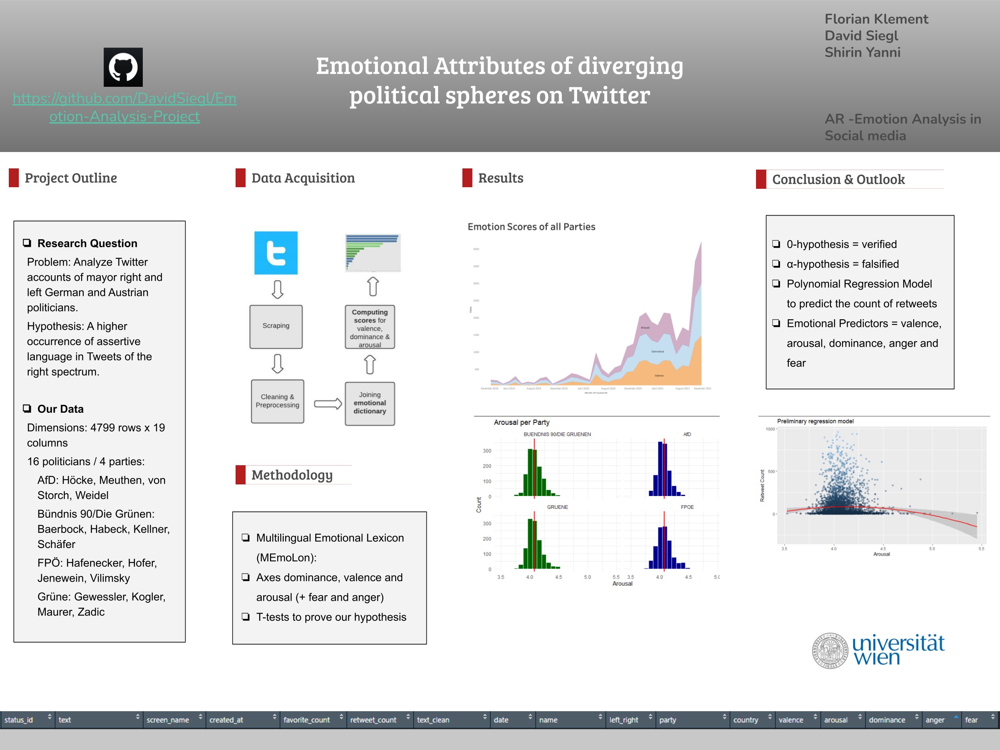

# Emotion-Analysis-Project

## Requirements:
- Load the required libraries in R ```requirements.txt```
- Download the emotion dictionary here: https://zenodo.org/record/3756607/files/MTL_grouped.zip?download=1

## TO-DO:
- statistical models: polynomial regression (predicting rt count)


